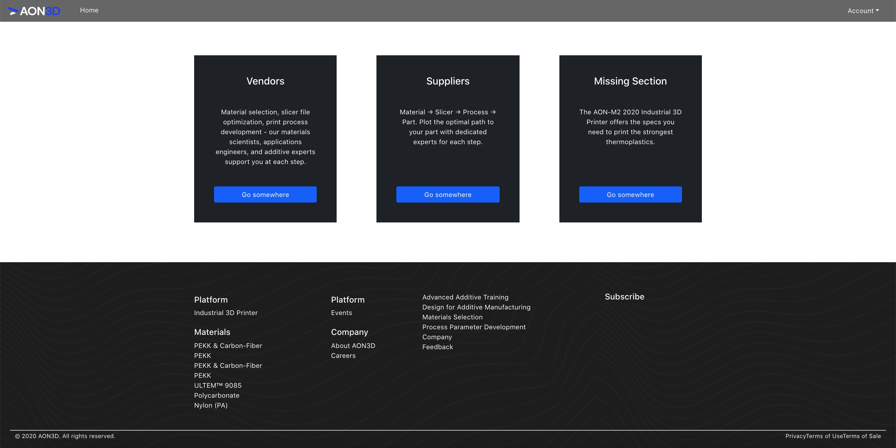
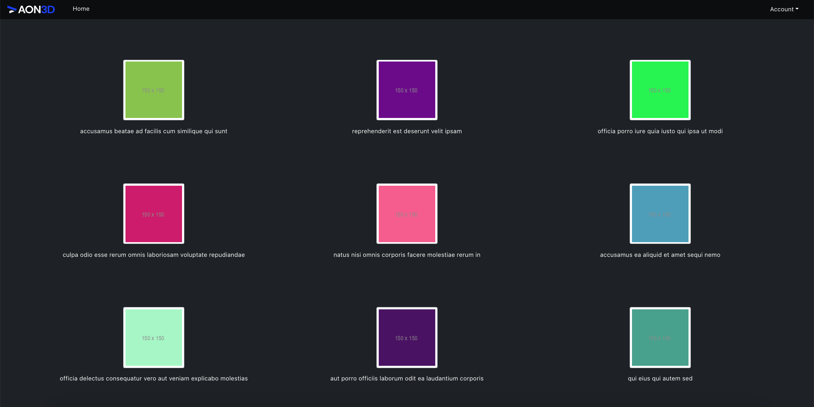
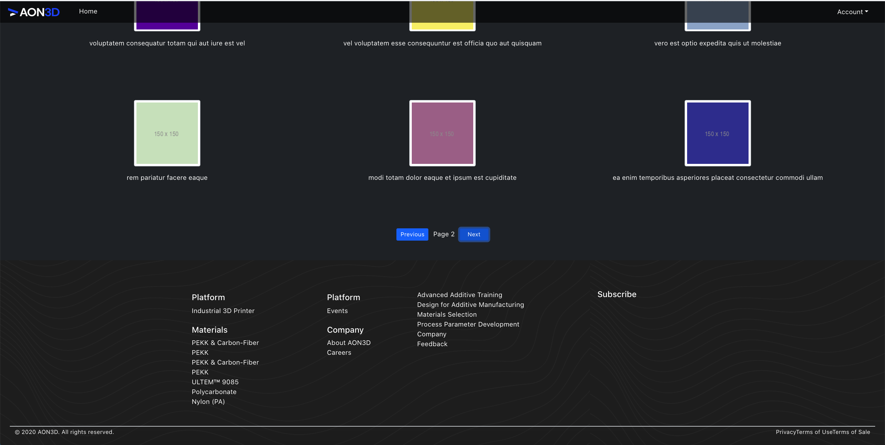
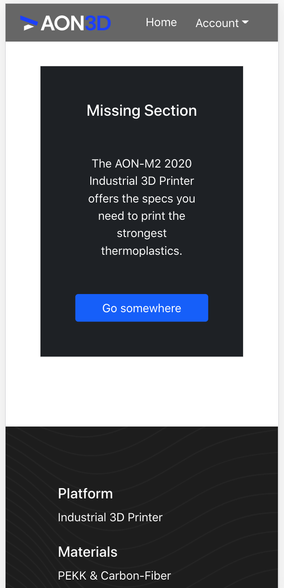
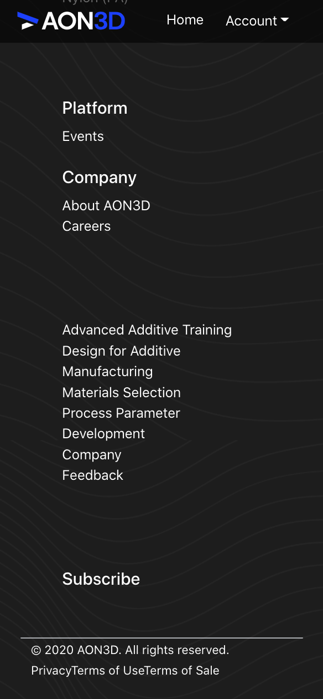
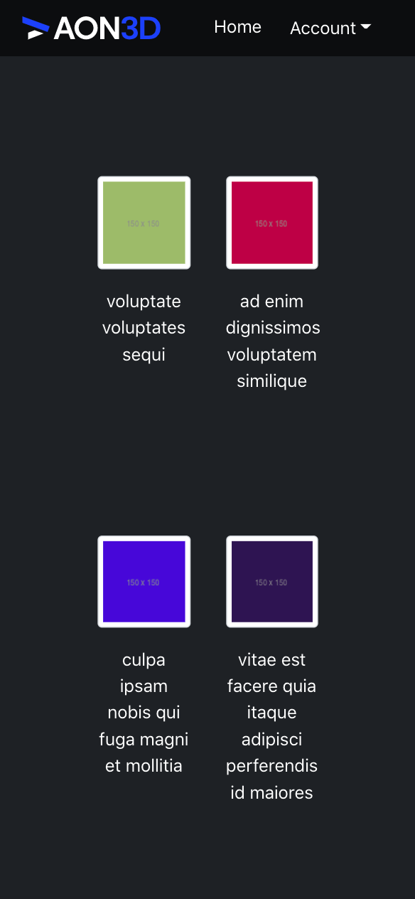

# AON3D

## Test Project

### Branches:

- main
- Api-integration

### Features:

- Home page created with given assets.
- Gallery page which used given API to collect it's data.

### Highlights:

- JavaScript
- React
- Bootstrap
- React-Bootstap
- HTML
- Responsive

 

 

  
 

  
 

  
 

 

  
 

